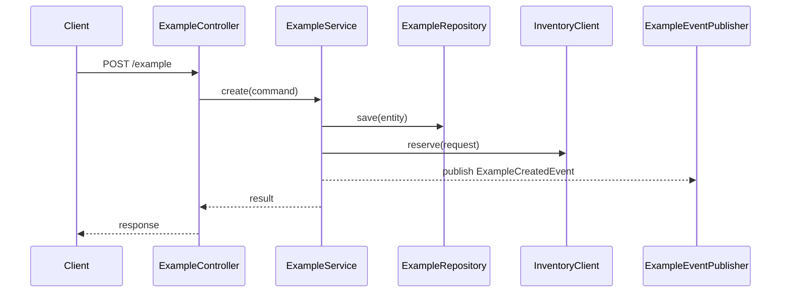

# Templates

## Stable Markdown Output

```md
# Generated API Documentation

## 1. Endpoint
- HTTP: `POST /example` (`src/main/java/.../ExampleController.java:10-24`) — Confirmed
- Entry: `ExampleController#create` (`src/main/java/.../ExampleController.java:10-24`) — Confirmed
- Evidence: `src/main/java/.../ExampleController.java:10-24` — Confirmed

## 2. End-to-End Call Chain
1. `ExampleController#create` (`...Controller.java:10-24`) — Confirmed
2. `ExampleService#create` (`...Service.java:30-56`) — Confirmed
3. `ExampleRepository#save` (`...Repository.java:12-20`) — Confirmed
4. `ExampleEventPublisher#publish` (`...Service.java:44-48`) — Confirmed

## 3. Step Details
| Step | Class#Method | Responsibility | Confidence | Evidence |
|---|---|---|---|---|
| 1 | `ExampleController#create` | Parse request and delegate | Confirmed | `...Controller.java:10-24` |
| 2 | `ExampleService#create` | Execute business flow | Confirmed | `...Service.java:30-56` |
| 3 | `ExampleRepository#save` | Persist entity | Confirmed | `...Repository.java:12-20` |
| 4 | `ExampleEventPublisher#publish` | Publish domain event after save | Confirmed | `...Service.java:44-48` |

## 4. Data Transformations
| From | To | Confidence | Evidence |
|---|---|---|---|
| `CreateRequest` | `CreateCommand` | Confirmed | `...Controller.java:16-18` |

## 5. Transaction / Async / Events
- Transaction: `@Transactional` on `ExampleService#create` (`...Service.java:30-56`) — Confirmed
- Async: no async boundary was confirmed — Unknown
- Events: `ExampleCreatedEvent` published via `ExampleEventPublisher#publish` (`...Service.java:44-48`) — Confirmed

## 6. External Dependencies
- Database: repository save path present (`...Repository.java:12-20`) — Confirmed
- HTTP/RPC: `InventoryClient#reserve` (`...Service.java:40-43`) — Confirmed
- MQ/Event consumer: not found — Unknown

## 7. Branches and Conditions
- If validation fails, throws `BizException` (`...Service.java:32-36`) — Confirmed
- Rollback behavior beyond annotation presence — Inferred

## 8. Unknowns
- Event consumer implementation was not found — Unknown
- Exact table name was not confirmed — Unknown

## 9. Evidence Index
- `src/main/java/.../ExampleController.java:10-24` — Confirmed
- `src/main/java/.../ExampleService.java:30-56` — Confirmed
- `src/main/java/.../ExampleService.java:40-48` — Confirmed
- `src/main/java/.../ExampleRepository.java:12-20` — Confirmed
```

## Mermaid Sequence Diagram



## Template Rules

1. Keep the section order exactly as shown.
2. Label every claim as `Confirmed`, `Inferred`, or `Unknown`.
3. In `End-to-End Call Chain`, list only in-process application calls. Put HTTP/RPC, database, MQ, and other external targets in `External Dependencies`.
4. Use the Mermaid diagram for the primary success path only; it may show external interactions that are omitted from the call chain.
5. Keep unsupported consumers, SQL, and table names out of the diagram.
6. For `Confirmed` claims outside tables, add inline evidence references when possible.
7. If evidence is missing, prefer `Unknown` over prose guesses.
8. Every bullet and numbered item outside tables must end with exactly one `Confirmed`, `Inferred`, or `Unknown` label.
9. If a controller, service, repository, or participant name is not evidenced, keep it generic in Markdown and Mermaid rather than inventing a symbol.
10. If the relative order of success-path steps is not evidenced, do not force an order in Mermaid; keep the uncertainty in Markdown and omit the ambiguous ordering from the diagram.
